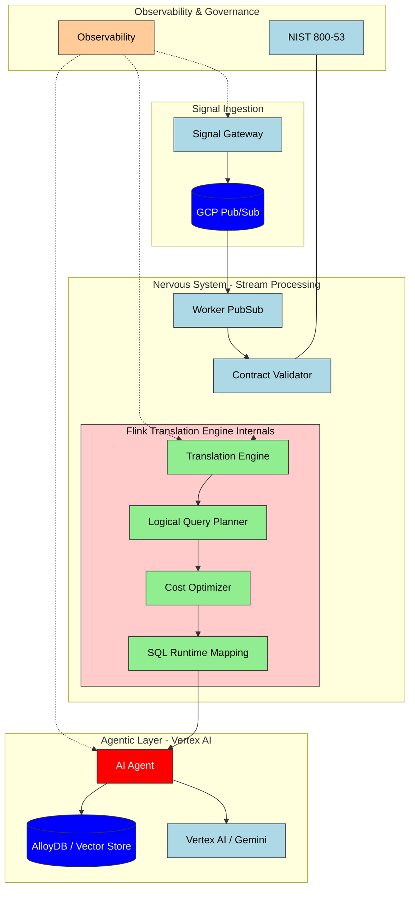

# MIA Agentic Data Nervous System (KFG-v3)

A production-grade reference architecture for **Autonomous Agentic Workflows** powered by **Stream Processing** and **Knowledge Flow Graphs (KFG)**. This project demonstrates a unified approach to real-time data translation, SQL-like query optimization for event streams, and LLM-driven decision making.

--- 
## 🏗 Architecture Diagram

---

# 🚀 Core Components

| Component | Responsibility | Flink / Confluent Parallel |
| :--- | :--- | :--- |
| **Signal Gateway** | Entry point for high-throughput asynchronous telemetry. Decouples producers from internal processing. | **Confluent Ingress / REST Proxy** |
| **Translation Engine** | The "Brain." Responsible for logical query planning and mapping signals to the Knowledge Flow Graph. | **Flink SQL Planner / Calcite** |
| **Cost Optimizer** | Evaluates the most efficient data traversal paths to minimize compute latency and LLM token usage. | **CBO (Cost-Based Optimizer)** |
| **Contract Validator** | Enforces structural integrity using Avro/Protobuf schemas to ensure "Stream-to-Database" reliability. | **Confluent Schema Registry** |
| **Worker PubSub** | Distributed processing unit that handles event-driven state transitions and resilience patterns. | **Flink TaskManager / Stream Operator** |
| **AI Agent** | Autonomous logic layer that uses Vertex AI to reason over enriched, real-time data streams. | **Streaming Consumer / UDF** |
| **Observability** | Integrated OpenTelemetry hooks for real-time monitoring of backpressure and transformation latency. | **Confluent Health / Metrics API** |

---

## 🛠 Tech Stack

### **Data & Streaming**
* **Engine:** Apache Flink (Architectural inspiration)
* **Messaging:** Google Cloud Pub/Sub (Scalable event bus)
* **Schema Management:** Avro & Protobuf (Strongly typed contracts)
* **Database:** AlloyDB (High-performance PostgreSQL-compatible state store)

### **AI & Orchestration**
* **LLM Provider:** Vertex AI / Gemini 1.5 Pro
* **Agentic Logic:** Custom Go-based "Nervous System" with Python-based Research Agents
* **Embeddings:** Vertex AI Vector Search

### **Infrastructure & DevOps**
* **Cloud:** Google Cloud Platform (GCP)
* **IaC:** Terraform (Modular multi-environment setup)
* **Containerization:** Docker & GKE (Google Kubernetes Engine)
* **Observability:** OpenTelemetry, Prometheus, and Grafana

### **Security & Compliance**
* **Standards:** NIST 800-53 (Enterprise-grade security controls)
* **Encryption:** KMS (Key Management Service) for data at rest and in transit

